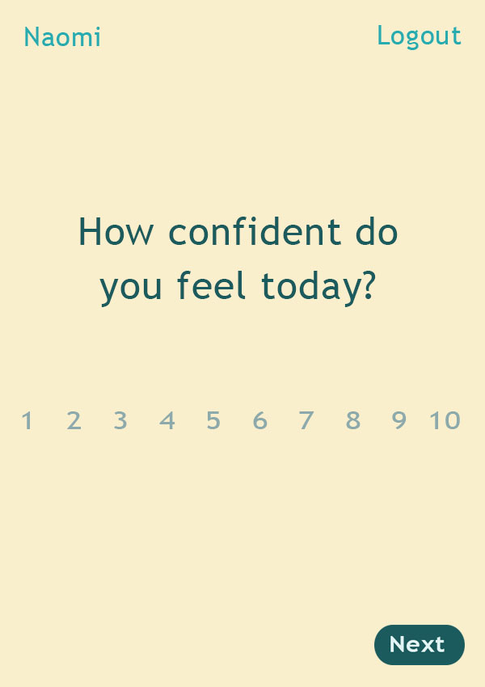
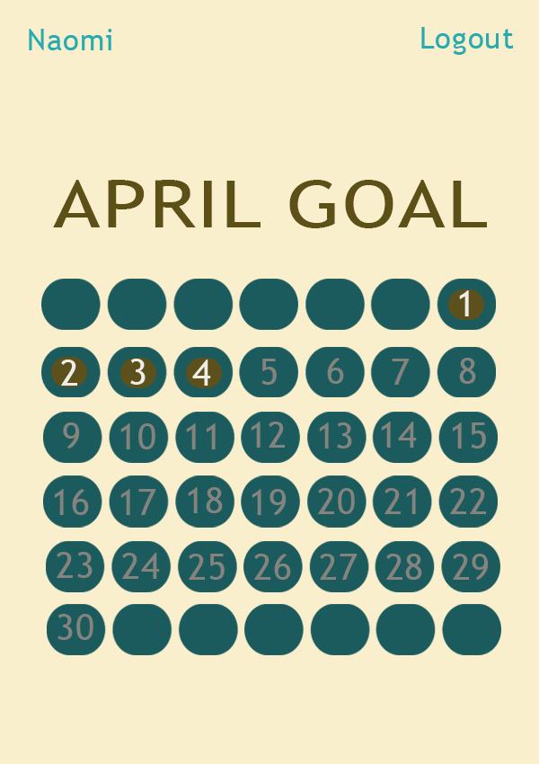

# Project_3_App
Mindfulness/Mood app

Run at: https://moodappproj3.herokuapp.com/home/register

Summary:
This application aims to encourage mindfulness by create an effective and hassle-free way for users to log feelings daily.
Built with React, Sinatra/Active Record with a Postresql database.

Expansion Plans:

*progress bar and back button on React route
*improve clarity of variable names 
*username and password specifications
*more succinct styling to home page, including check marks on completed days
*limitation on number entry to ensure the number is between one and ten, or a list of numbers keyed to an associated number value rather than an input field

Background:

In order to make the user's process simple and finite, I have limited users to completing the question cycle once a day. I intentionally do not currently have a method for users to view their data from previous days, in order to encourage a fresh mindset every day; a key conceptual point in this project involves distortion in perspective when thinking/looking back upon one's emotional health. I would like to add components of statistical analysis down the line so the user can see their averages, mood ratings, trends, descriptive word frequency, correlations between words and mood numbers, etc., after a period of time (two months or so of consistent use). Ideally, I would like to incorporate principles of data visualization and collaborate with both data experts and UX designers to figure out how best to convey mood trends over time to the user.

Wireframes:

